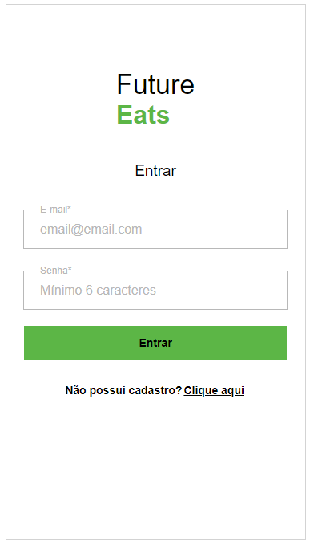

# `Projeto`
Projeto LabeFoods

# `Link`
https://labefoods-alves5.surge.sh

# `Descrição`
O Projeto LabeFoods foi desenvolvido como projeto final de Front End dentro do curso Full-Stack Web Developer da Labenu, o qual consiste em requisições (via axios) para a API labeFoods, que é uma API da Labenu com informações relacionadas ao desenvolvimento de uma aplicação que simula um aplicativo semelhante ao conhecido app iFood.
O tema que recebemos foi do layout FutureEats.
*a API pode ser encontrada [aqui]https://documenter.getpostman.com/view/7549981/SWTEdGtT)
 
O repositório do projeto pode ser encontrado [aqui](https://github.com/future4code/Alves-labe-food5)

# `Modo de usar`
Ao iniciar a aplicação o usuário se deparará com uma tela para efetuar Login, caso tenha, ou se inscrever na plataforma, criando um usuário com nome, email, senha e dados de endereço.
 
Após efetuar login, o usuário poderá escolher entre diferentes tipos de restaurantes, como comida Asiática, Hamburgueres, Italiana, Sorvetes, Carnes, Baiana, Petiscos e Mexicana.
 
Entrando em um restaurante, será listado todos os alimentos fornecidos pelo estabelecimento em questão, podendo adicionar e remover produtos, escolher a quantidade, forma de pagamento e ser informado do custo do frete e do valor de cada produto.
 
Após escolher o seu pedido, o usuário deve ir até a tela de carrinho de compras, na qual se encontra no botão central no rodapé da página, nele, o usuário terá informações do endereço de entrega, informações sobre o restaurante escolhido com o prazo para a entrega.
 
Também nesta mesma página, terá a lista dos alimentos, assim como sua quantidade e opção de remover do carrinho caso o usuário desista de algo.
 
Ao final da página, tem os custos do pedido, as opções de pagamento e confirmação do pedido, que ao clicar em confirmar, será exibida uma mensagem de pedido realizado com sucesso.
 
No botão da direita, no rodapé, existe um botão para ir para o perfil do usuário, na qual podemos modificar informações de cadastro.

# `Instalando e rodando o projeto`
Fazer o clone do projeto:
- git clone link-do-repositório

Instalar as dependências:
- npm install

Rodar o projeto:
- npm run start

# `Tecnologias utilizadas`

# `Autores`
Evandro Paulo Folletto;
José Robinaldo Ramos da Silva; 
Leonardo José Silva Lopes de Souza; 
Márleo Piber da Rosa; 
Olavo Marques do Nascimento.

# `Imagens`
### Página Login

### Página SignUp (Cadastro)

### Página Feed

### Página Restaurante escolhido

### Página Carrinho

### Página Perfil

### Página Editar perfil

### Página Editar Endereço
